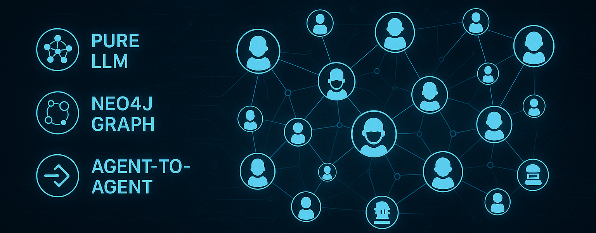

<!-- Language Toggle -->
[English](#english) | [中文](#中文)

---

<div id="中文">

# Smart Memory
基于 Python 的后端，使用一系列智能体网络来管理用户的知识和记忆，完全不依赖 RAG（检索增强生成）。各智能体通过 Google 的 agent-to-agent 协议通信，并基于 Neo4j 构建社交图进行交互。

<p align="center">
    </a></a>
    </a></a>
    </a></a>
    </a></a>
    </a>
    </br>
    </a></a>
    </a></a>
    </a></a>
    </a></a>
</p>


<h1 align="center">
  <br>
  
  <br>
</h1>


## 目录

- [概述](#概述)
- [架构](#架构)
- [功能](#功能)
- [类定义](#类定义-1)
- [目录结构](#目录结构-1)
- [安装](#安装-1)
- [配置](#配置-1)
- [使用](#使用-1)
- [Neo4j 集成](#neo4j-集成)
- [贡献](#贡献-1)
- [许可证](#许可证)

## 概述

本项目模拟一个智能体虚拟公司，每个智能体拥有各自的技能和记忆。智能体之间通过传递任务协作，处理用户请求、管理记忆，并维护相互关系，完全不使用 RAG 技术。智能体网络的数据存储和查询由 Neo4j 驱动，以模拟社交图。

## 架构

1. **智能体网络**：每个智能体为 Neo4j 图中的一个节点，通过关系表示通信链接和记忆推荐。
2. **Agent-to-Agent 协议**：智能体使用 Google 标准协议发送 `TaskEvent`。
3. **任务管理**：`TaskManager` 负责观察和协调任务流程，包括提交、委派和响应。
4. **记忆管理**：`MemoryAgent` 专门存储和检索 `Memory` 对象，并跟踪访问模式。
5. **技能抽象**：`Skill` 对象定义智能体能力，列出支持的输入输出模式和示例提示。

## 功能

- 纯 LLM 驱动的知识提取和推理
- 纯智能体间通信，无需嵌入或 RAG
- 基于 Neo4j 的动态社交图管理智能体关系
- 模块化类设计，易于扩展
- 详尽的任务与记忆访问日志

## 目录结构

```plaintext
your_project/
├── app.py                # Flask/FastAPI 入口脚本
├── requirements.txt      # Python 依赖清单
├── backend/              # 核心应用包
│   ├── agents/           # 智能体基类及子类
|   ├── skills/           # 技能
│   ├── tasks/            # TaskManager, TaskEvent, TaskStatus
│   ├── memory/           # MemoryAgent, Memory
│   ├── graph/            # GraphBuilder (Neo4j 集成)
│   └── llm/              # LLM 接口
├── tests/                # 单元测试
└── docs/                 # 文档
```

## 安装

1. 克隆仓库：
   ```bash
   git clone https://github.com/your_org/agent-knowledge-system.git
   cd agent-knowledge-system
   ```
2. 创建虚拟环境并安装依赖：
   ```bash
   python3 -m venv venv
   source venv/bin/activate
   pip install -r requirements.txt
   ```

## 配置

1. **Neo4j**：确保 Neo4j 实例运行，将 `NEO4J_URI`、`NEO4J_USER`、`NEO4J_PASSWORD` 配置为环境变量或 `config.yml`。
2. **OpenAI API**：设置 `OPENAI_API_KEY`。

## 使用

```bash
# 启动后端
python app.py
```

- REST API 暴露提交用户查询、查看智能体关系及任务日志的端点。

## Neo4j 集成

`GraphBuilder` 模块负责：

- 通过 Bolt 协议连接 Neo4j
- 创建智能体节点及 `:KNOWS` 关系
- 查询智能体间路径以实现任务委派

## 贡献

1. Fork 本仓库
2. 创建功能分支
3. 为新功能编写测试
4. 提交 Pull Request

## 许可证

本项目基于 MIT 许可证。

</div>


<div id="english">

# Smart Memory


A Python-based backend for managing user knowledge and memory using a network of AI agents, without relying on RAG (Retrieval-Augmented Generation). Agents communicate via Google’s agent-to-agent protocol and interact through a Neo4j-powered social graph.


## Overview

This project simulates a virtual company of intelligent agents, each with skills and memories. Agents collaborate by passing tasks among themselves to fulfill user queries, manage memories, and maintain relationships, all without RAG techniques. The inter-agent network is stored and queried in Neo4j to model a social graph.

## Architecture

1. **Agent Network**: Each agent is a node in a Neo4j graph, connected by relationships that represent communication links and memory referrals.
2. **Agent-to-Agent Protocol**: Agents send `TaskEvent`s to one another using Google’s standard protocol for agent communication.
3. **Task Management**: A `TaskManager` observes and coordinates task flow, handling submission, delegation, and responses.
4. **Memory Management**: Specialized `MemoryAgent`s store and retrieve `Memory` objects, tracking access patterns.
5. **Skill Abstraction**: Agents expose capabilities via `Skill` objects, listing supported input/output modes and example prompts.

## Features

- Pure LLM-based knowledge extraction and reasoning
- Agent-to-agent communication without embeddings or RAG
- Neo4j-based social graph for dynamic agent relationships
- Modular class design for extensibility
- Detailed logging of tasks and memory accesses


## Directory Structure

```plaintext
your_project/
├── app.py                # Flask/FastAPI entry point
├── requirements.txt      # Python dependencies
├── backend/              # Core application packages
│   ├── agents/           # Agent base and subclasses
|   ├── skills/           # skills for agent
│   ├── tasks/            # TaskManager, TaskEvent, TaskStatus
│   ├── memory/           # MemoryAgent, Memory
│   ├── graph/            # GraphBuilder (Neo4j integration)
│   └── llm/              # LLM interface
├── tests/                # Unit tests
└── docs/                 # Documentation
```

## Installation

1. Clone the repository:
   ```bash
   git clone https://github.com/your_org/agent-knowledge-system.git
   cd agent-knowledge-system
   ```
2. Create a virtual environment and install dependencies:
   ```bash
   python3 -m venv venv
   source venv/bin/activate
   pip install -r requirements.txt
   ```

## Configuration

1. **Neo4j**: Ensure a running Neo4j instance. Configure `NEO4J_URI`, `NEO4J_USER`, and `NEO4J_PASSWORD` in environment variables or `config.yml`.
2. **OpenAI API**: Set `OPENAI_API_KEY` for LLM access.

## Usage

```bash
# Start the backend
python app.py
```

- The REST API exposes endpoints to submit user queries, inspect agent relations, and view task logs.

## Neo4j Integration

The `GraphBuilder` module handles:

- Connecting to Neo4j via Bolt protocol
- Creating agent nodes and `:KNOWS` relationships
- Querying for pathways between agents when delegating tasks

## Contributing

1. Fork the repository
2. Create a feature branch
3. Write tests for new functionality
4. Submit a pull request

## License

This project is licensed under the MIT License.

</div>

---

## Contributors / 贡献者

<table>
  <tbody>
   <td align="center" valign="middle" width="128">
         <a href="https://github.com/bochendong">
          
          Bochen Dong
        </a>
        <br>
        <sub><sup>Team Member</sup></sub>
      </td>
      <td align="center" valign="middle" width="128">
        <a href="https://github.com/VGLALALA">
          
          Sting Zhang
        </a>
        <br>
        <sub><sup>Team Leader</sup></sub>
      </td>
      <td align="center" valign="middle" width="128">
         <a href="https://github.com/nancyzhao1">
          
          Nancy Zhao
        </a>
        <br>
        <sub><sup>Team Member</sup></sub>
      </td>
      <td align="center" valign="middle" width="128">
         <a href="https://github.com/Tabel0112">
          
          Abel Chen
        </a>
        <br>
        <sub><sup>Team Member</sup></sub>
      </td>
     
     
  </tbody>
</table>